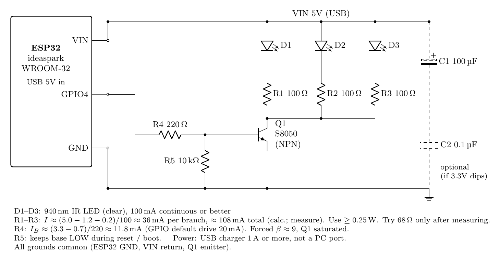

# control-air-with-phone

iPhone から三菱電機エアコンを操作する個人プロジェクト。
iPhone → Cloudflare Worker / Durable Object → WebSocket (TLS) → ESP32 → 赤外線 → エアコン。

Control a Mitsubishi air conditioner from an iPhone via Cloudflare and an ESP32 IR transmitter. Designed first (spec + 20 ADRs), built in 8 gated stages, installed and in daily use since 2026-09-18.



## 何ができるか

- iPhone アプリから電源・モード・温度・風量・風向を設定して即時送信
- 「この時刻にこの設定で」の一発予約 1 件（Durable Object の Alarm で発火）
- ESP32 は常時 WebSocket 接続。電源断やルーター再起動後は 30 秒周期で自動復帰
- 外出先からも同じ操作（LAN 直通経路は作らず、クラウド経由のみ。ADR-002）

## 構成

```
 iPhone (SwiftUI)
    │  HTTPS + Bearer(APP_TOKEN)
    ▼
 Cloudflare Worker ── 認証・API (/command, /schedule)
    │  RPC
    ▼
 Durable Object "home" ── 18 バイトの赤外線フレームを生成、予約 1 件を保持、Alarm
    │  WebSocket over TLS (Hibernation)、Bearer(DEVICE_TOKEN)
    ▼
 ESP32-WROOM-32 ── 36 文字の HEX を受けて IRremoteESP8266 で送信するだけ
    │  GPIO4 → S8050 → IR LED ×3 (940nm)
    ▼
 三菱電機 エアコン (MITSUBISHI_AC, 144 bit)
```

設計の要点は「ESP32 を最小にし、判断はすべてクラウドに置く」（ADR-001, 008）。
機器プロトコルは片方向で、Durable Object → ESP32 に 36 文字の大文字 HEX を 1 フレーム送るだけ（ADR-010）。ESP32 は返答せず、不正入力は黙って捨てる。

## 技術スタック

| 層 | 主な技術 |
|---|---|
| iOS | SwiftUI, Keychain（トークン保管）, XCTest, xcodegen |
| クラウド | Cloudflare Workers, Durable Objects (SQLite, WebSocket Hibernation, Alarm), TypeScript, wrangler, vitest + `@cloudflare/vitest-pool-workers` |
| ファーム | arduino-esp32 3.3.11, IRremoteESP8266, arduinoWebSockets, Mozilla CA bundle (`gen_crt_bundle.py`) |
| ハード | ESP32-WROOM-32, S8050 + 100Ω ×3 で IR LED 駆動（約 36 mA/個）, 回路図は CircuiTikZ |
| ドキュメント | 設計書, ADR ×20, レビュー記録, 試験記録, 振り返り |

テスト: Cloudflare 49 件（純粋関数 + workerd 上の統合）, iOS 12 件, ファームは host 側で `ir_frame.h` の単体テスト。

## リポジトリ構成

| 場所 | 内容 |
|---|---|
| [`cloudflare/`](cloudflare/) | Worker と Durable Object。`encoder.ts` が三菱フレーム生成の中心 |
| [`firmware/aircon_bridge/`](firmware/aircon_bridge/) | 本番ファーム（状態機械、TLS、Task WDT） |
| [`firmware/ir_serial_test/`](firmware/ir_serial_test/) | Wi-Fi なしでシリアルから赤外線を出す試験スケッチ |
| [`ios/AirconRemote/`](ios/AirconRemote/) | SwiftUI アプリ（設定・操作・予約） |
| [`tools/`](tools/) | 赤外線の採取・解析、回路電圧の測定、Wi-Fi スキャン用スケッチ |
| [`docs/`](docs/) | 下記 |

## ドキュメント

| 文書 | 内容 |
|---|---|
| [docs/design.md](docs/design.md) | 現行仕様（API、機器プロトコル、フレーム規則、ログ、障害判断表） |
| [docs/adr.md](docs/adr.md) | 設計判断 ADR-001〜020。なぜその構成にしたか |
| [docs/review-2026-09-13.md](docs/review-2026-09-13.md) | 実装前の設計レビュー 2 往復（17 件） |
| [docs/implementation-plan.md](docs/implementation-plan.md) | 8 段階の実装計画と通過条件、進行表 |
| [docs/ir-captures.md](docs/ir-captures.md) | 実機リモコンの赤外線採取と規則の導出 |
| [docs/test-log.md](docs/test-log.md) | 各段階の試験記録とつまずき一覧 |
| [docs/dev-retrospective.md](docs/dev-retrospective.md) | 開発の振り返り。つまずき・原因・解決 |
| [docs/stage5-procedure.md](docs/stage5-procedure.md) | 障害系試験の手順（診断用） |
| [docs/circuit/](docs/circuit/) | 赤外線送信回路図（`.tex` / `.pdf` / `.png`） |

## 開発で得た知見（抜粋）

- **ESP32 が 5 秒ごとに再起動する**: arduino-esp32 3.x の `enableCore1WDT()` は IDLE1 を監視対象に加えるだけで idle hook を登録しない。`esp_register_freertos_idle_hook_for_cpu` と `loop()` 末尾の `delay(1)` を揃えて解決（ADR-006、[振り返り 3.4](docs/dev-retrospective.md)）
- **ライブラリの列挙 ≠ 手元のリモコン**: 三菱リモコンに自動モード・送風・静音・風量 4 はなかった。テストベクトルは実機採取値に置き換えた（ADR-019）
- **`digitalWrite` は `pinMode` 前だと無効**（core 3.x）。起動時のラッチ初期化は `gpio_set_level()` で行う
- **失敗ログには理由コードを付ける**: `wifi_failed status=1` で 5GHz SSID が原因と即断できた

## 自分で動かす

各ディレクトリの README を参照。おおまかには

1. `cloudflare/`: `npm install` → `npx wrangler secret put DEVICE_TOKEN` / `APP_TOKEN` → `npm run deploy`
2. `firmware/aircon_bridge/`: `secrets.example.h` を `secrets.h` にコピーして SSID・パスワード・ホスト・トークンを記入（2.4GHz のみ）→ Arduino IDE で書き込み
3. `ios/AirconRemote/`: `xcodegen generate` → Xcode で実行 → 設定画面に Worker の URL と APP_TOKEN を入力

`secrets.h` と Worker のシークレットはリポジトリに含まれません。

## ライセンス

MIT
